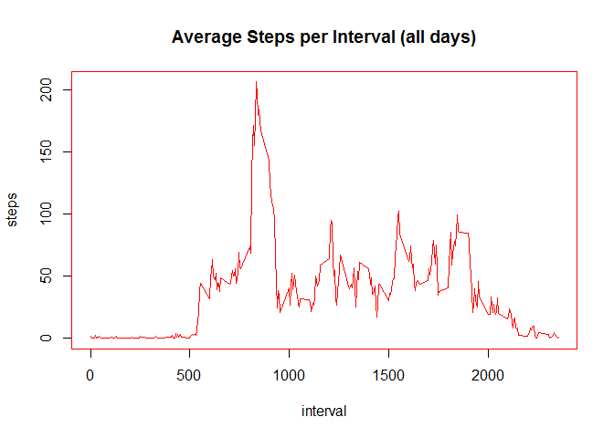
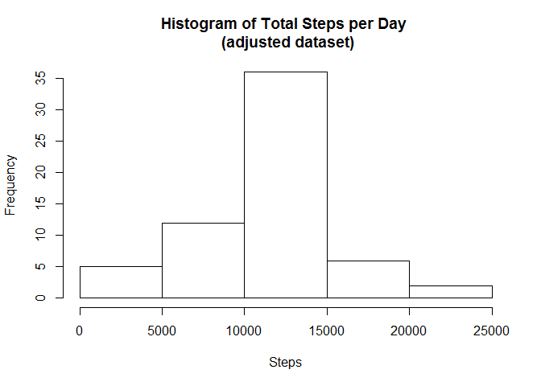
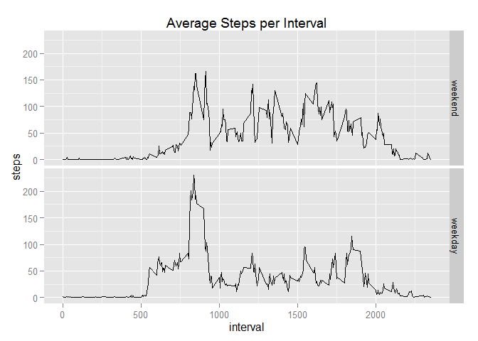

# Reproducible Research -- Assignment 1
pmarkt  
Monday, September 14, 2015  

This report documents my analysis of Activity Monitoring data from a personal monitoring device (such as FitBit or Jawbone Up.) The dataset consists of two months of data from one anonymous individual collected during the months of October and November, 2012.

The URL for the original zipped data file is 
https://d396qusza40orc.cloudfront.net/repdata%2Fdata%2Factivity.zip

The dataset is stored in a comma-separated-value (CSV) file named "activity.csv". There are a total of 17,568 observations and 3 variables. As stated in the assignment, it is assumed that the file "activity.csv" is included in the GitHub repository where this document resides.

The variables included in the dataset are:

* steps: Number of steps taking in a 5-minute interval (missing values are coded as NA)

* date: The date on which the measurement was taken in YYYY-MM-DD format

* interval: Identifier for the 5-minute interval in which the measurement was taken

#### Step 1 -- Loading and preprocessing the data

Load the Activity Monitoring Data from activity.csv


```r
  data <- read.csv("./activity.csv",header=T,stringsAsFactors=FALSE)
```

Convert date from character to date format, and determine weekday or weekend


```r
    data[,2] <- as.Date(data[,2],"%m/%d/%Y")
    data$day <- weekdays(as.Date(data$date))
    weekdays1 <- c("Monday","Tuesday","Wednesday","Thursday","Friday")
    data$daytype <- factor((weekdays(data$date) %in% weekdays1),levels=c(FALSE,TRUE),
            labels=c("weekend","weekday"))
    str(data)
```

```
## 'data.frame':	17568 obs. of  5 variables:
##  $ steps   : int  NA NA NA NA NA NA NA NA NA NA ...
##  $ date    : Date, format: "2012-10-01" "2012-10-01" ...
##  $ interval: int  0 5 10 15 20 25 30 35 40 45 ...
##  $ day     : chr  "Monday" "Monday" "Monday" "Monday" ...
##  $ daytype : Factor w/ 2 levels "weekend","weekday": 2 2 2 2 2 2 2 2 2 2 ...
```

Load libraries (suppress warnings in the resulting md and html files from this code chunk)


```r
  library(dplyr)
  library(ggplot2)
```

#### Step 2 -- What is mean total number of steps taken per day?

Summarize total steps per day (excluding NA values)

```r
    Daily <- subset(data,!is.na(steps))%>%
        group_by(date)%>% 
        summarise(SUM=sum(steps))
```

Create histogram


```r
    hist(Daily$SUM,main="Histogram of Total Steps per Day",xlab="Steps")
```

 

Calculate mean and median steps per day


```r
Daily%>%
      summarise(Mean_Steps_per_day=mean(SUM),Median_Steps_per_day=median(SUM))
```

```
## Source: local data frame [1 x 2]
## 
##   Mean_Steps_per_day Median_Steps_per_day
## 1           10766.19                10765
```

#### Step 3 -- What is the average daily activity pattern?


```r
data <- arrange(data,interval)
Interval <- subset(data,!is.na(steps))%>%
  group_by(interval)%>% 
  summarise(Mean_Steps_per_interval=mean(steps))
```

Graph average steps per interval


```r
par(col="red") 
plot(Interval$interval,Interval$Mean_Steps_per_interval, type="n", main="Average Steps per Interval (all days)",xlab="interval",ylab="steps") 
lines(Interval$interval,Interval$Mean_Steps_per_interval)
```

 

Determine which interval has the maximum number of average steps


```r
 Max_Interval <- Interval[which.max(as.matrix(Interval[,2])),1]
 Max_Interval
```

```
## Source: local data frame [1 x 1]
## 
##   interval
## 1      835
```

#### Step 4 -- Imputing missing values

Calculate the total number of missing values in the dataset


```r
  Rows_with_missing_values <- sum(is.na(data))
  Rows_with_missing_values
```

```
## [1] 2304
```

Fill in missing values for individual intervals with mean steps for that interval  
      and store the adjusted dataset in data2


```r
  data <- arrange(data,interval)
  Interval <- arrange(Interval,interval)
  data2 <- merge(data,Interval,by="interval")
  data2[is.na(data2$steps),2] <- data2[is.na(data2$steps),6]    
```

Calculate mean and median steps per day for the adjusted dataset


```r
  Daily2 <- data2%>%
      group_by(date)%>% 
      summarise(Daily_Steps=sum(steps))
```
    
Create histogram of steps per day from the adjusted dataset


```r
  hist(Daily2$Daily_Steps,main="Histogram of Total Steps per Day \n (adjusted dataset)",
             ,xlab="Steps")
```

 

Calculate mean and median steps per day

```r
  Stats2 <- Daily2%>%
      summarise(Mean_Steps_per_day=mean(Daily_Steps),
      Median_Steps_per_day=median(Daily_Steps))
  Stats2
```

```
## Source: local data frame [1 x 2]
## 
##   Mean_Steps_per_day Median_Steps_per_day
## 1           10766.19             10766.19
```

#### Step 5 -- Are there differences in activity patterns between weekdays and weekends?

Compute statistics by weekend vs weekday and create a panel plot


```r
    Interval2 <- data2%>%
        group_by(daytype,interval) %>%
        summarise(Mean_daytype_Steps_per_interval=mean(steps))
```

Create a panel plot comparing average steps per interval for weekdays vs weekend days


```r
        g <- ggplot(Interval2, aes(interval,Mean_daytype_Steps_per_interval)) + geom_line()
        g + facet_grid(daytype ~ .) +
        labs(title="Average Steps per Interval") +
        labs(y="steps")
```

 
